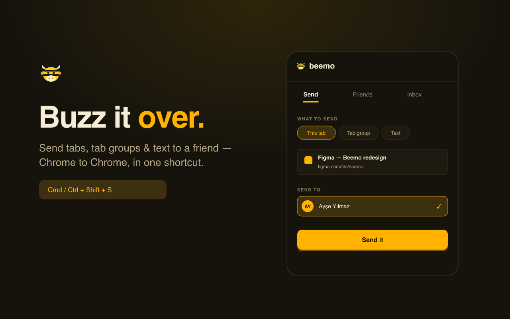
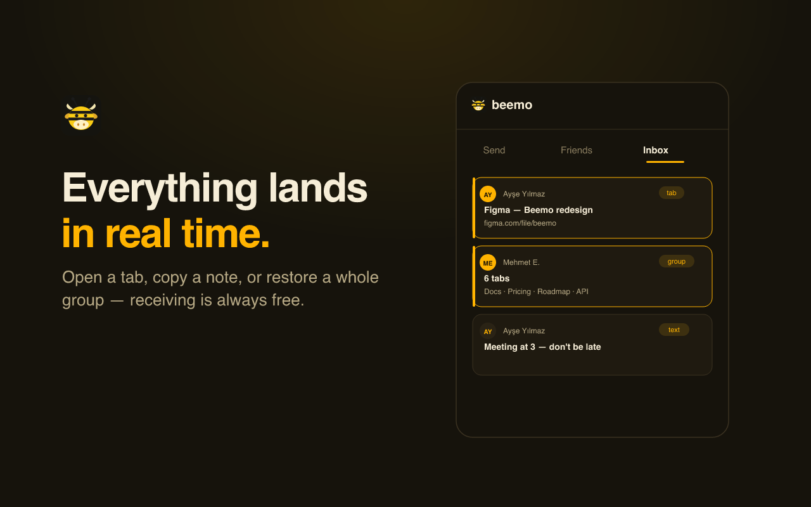

<div align="center">


# Beemo

### Send tabs, tab groups & text to a friend — Chrome to Chrome.

One shortcut, pick a friend, and it lands in their browser instantly.
No more copying links into WhatsApp or Discord.

**[yourfavbeemo.com](https://yourfavbeemo.com)** · Free · Manifest V3 · Chrome side panel

</div>

---

<div align="center">


</div>

## What it does

Beemo is the fastest way to share with a friend, browser to browser. Hit a shortcut,
choose a friend, and whatever you're sending shows up in their Beemo inbox in real time.

- 🔗 **Send any tab** — the page you're on, or any link
- 🗂️ **Whole tab groups** — share a research session; trim the tabs you don't want first
- 📝 **Text & notes** — type it, or right-click selected text on any page
- 📋 **Carry form data** — optionally bring what you typed in a page's forms (passwords never included)
- 👥 **Friends & invites** — add by email, or share an invite link that auto-connects
- ⚡ **Real-time inbox** — open a tab, copy a note, or restore a whole group with a tap
- ⌨️ **Shortcut** — `Cmd/Ctrl + Shift + S` opens Beemo ready to send the current tab

**Completely free.** No limits, no subscription.

## How it works

1. **Add a friend** — by email or an invite link. They receive for free, always.
2. **Hit the shortcut** — the side panel opens with your current tab ready.
3. **Pick & send** — choose a friend and it lands in their Chrome instantly.

## Tech

- **Extension**: Manifest V3 — `sidePanel`, `commands`, `contextMenus`, `scripting`, `tabs`/`tabGroups`
- **Backend**: Firebase (Google Auth + Firestore real-time). No server to run.
- **Build**: esbuild bundles Firebase locally (MV3 forbids remote code); the Space Grotesk
  webfont and the bee-cow logo are bundled too.
- **Privacy by design**: items go only to the friend you pick; form-fill is opt-in, per-site,
  and never includes password fields. Inbox items auto-expire.

## Run locally

```bash
npm install
npm run build          # outputs dist/
```
Then `chrome://extensions` → enable Developer mode → **Load unpacked** → select `dist/`.

To use your own backend, plug a Firebase web config into `src/config.js` and a Google
OAuth client ID into `src/manifest.json` (see comments in those files).

```
src/        extension source        functions/   (optional) billing webhook
build.mjs   esbuild + icon raster    admin/       local users dashboard
dist/       build output             docs/        marketing site (yourfavbeemo.com)
```

## Links

- 🌐 Website — [yourfavbeemo.com](https://yourfavbeemo.com)
- 🔒 [Privacy Policy](https://yourfavbeemo.com/privacy.html) · [Terms](https://yourfavbeemo.com/terms.html)
- ✉️ Contact — lorienapptr@gmail.com

<div align="center"><sub>Built with 🐝 — just Beemo it.</sub></div>
